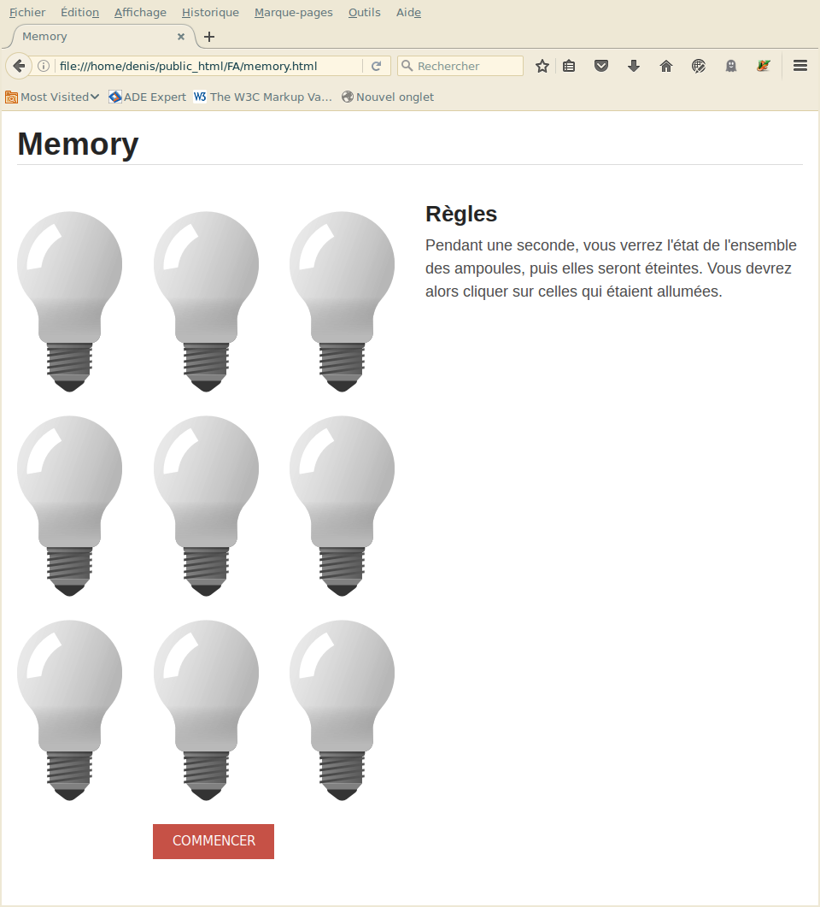
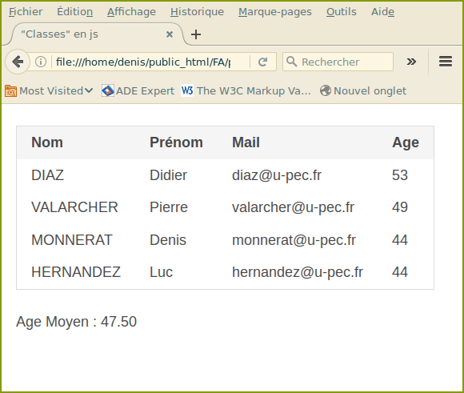

# TP javascript : bases du langages.

1. Un (petit) memory.

	Le jeu tirera aléatoirement des ampoules allumées, les dévoilera 
	pendant une seconde au joueur, puis les cachera à nouveau.
	Le joueur doit alors cliquer sur chaque ampoule initialement allumée. S'il se trompe, 
	une alerte lui signifie qu'il a perdu. Lorsque toutes les ampoules ont été retrouvées, le joueur gagne.

	

	Pour les plus rapides, afficher un compte à rebours au bout du quel la partie est perdue.
	Vous devez seulement complèter le fichier `memory.js`

	**Quelques conseils**


	- Les images d'un document sont accessibles via `document.images`. 
	C'est une collection html itérable, avec `for ... of ...`
	- Pour le tirage aléatoire, utilisez `Math.random`
	- Pour le dévoilement initial des images pendant une seconde, utilisez la méthode `setTimeout`.
	- Pour la gestion du temps restant, dant une seconde, utilisez la méthode `setInterval` et `clearInterval`.
	- Ajouter à chaque image une fonction réflexe en réponse au click.
	- Écrire du code propre et objet.

2. 
  1. La classe `Personne` est définie par la fonction ("constructeur") suivante :

		```js
		function Personne(nom,prenom,mail,age,amis){
			this.nom=nom||"";
			this.prenom=prenom||"";
			this.mail=mail||"";
			this.age=age||0;
			this.amis=amis||[];
		}
		 
		var Denis=new Personne("Monnerat","Denis","monnerat@u-pec.fr",44);
		var Pierre=new Personne("Valarcher","Pierre","valarcher@u-pec.fr",49);
		var Didier=new Personne("Diaz","Didier","diaz@u-pec.fr",53);
		var Luc=new Personne("Hernandez","Luc","hernandez@u-pec.fr",44);
		var DeptInfo = [];
		DeptInfo.push(Denis,Luc,Pierre,Didier);
		 
		Personne.prototype.toHtmlRow=function(){
			return "<tr>"
					+"<td>"+this.nom+"</td>"
					+"<td>"+this.prenom+"</td>"
					+"<td>"+this.mail+"</td>"
					+"<td>"+this.age+"</td>"
					+"</tr>";
		}
		 
		function AfficherTable(personnes){
		 
		document.writeln("<table class='_b1'>"
				+"<thead><th>Nom</th><th>Prénom</th><th>Mail</th><th>Age</th></thead>");
		document.writeln("<tbody>");
		personnes.forEach(function(p){
			document.writeln(p.toHtmlRow());
			})
		document.writeln("</tbody></table>");
		 
		//document.writeln("<p>Age Moyen : "+age.toFixed(2)+"</p>");
		}
		```

		

		- A l'aide de la fonction `sort`, triez le tableau DeptInfo par ordre décroissant d'age, puis par ordre alphabétique des noms.
		- A l'aide la fonction `map`, passez tous les noms en majuscule.
		- A l'aide de la fonction `reduce`, calculez et affichez l'age moyen (2 décimales) des personnes DeptInfo.
		- En passant par le prototype, ajouter une méthode qui permet d'ajouter un ami (une personne) à une personne.
		- Ajoutez une méthode `toHtml` qui permet de formater une personne sous forme html (on affichera uniquement le prénom et nom des amis).
		- Ajoutez une méthode `estAmi` qui permet de savoir si deux personnes sont amis.
  2. On veut faire dériver la "classe" personne en professeur, en rajoutant les matières enseignées. Proposez une solution et testez.

3. Le numéro iban d'un compte français est constitué de 6 blocs de 4 caractères, suivi d'un bloc de 3 caractères.

    ```
	FRkk BBBB BGGG GGCC CCCC CCCC CKK
	```
	Avec le codage suivant : B = code banque, G = code guichet, C = numéro de compte, K = clef

	On simule, dans un formulaire, un numéro iban nécessaire à un paiement.

	- Faites en sorte que lorque tous les caractères d'un bloc ont été saisies, le focus passe automatiquement au bloc suivant.
	- Modifiez votre programme pour qu'il ne dépende pas du nombre de blocs.
