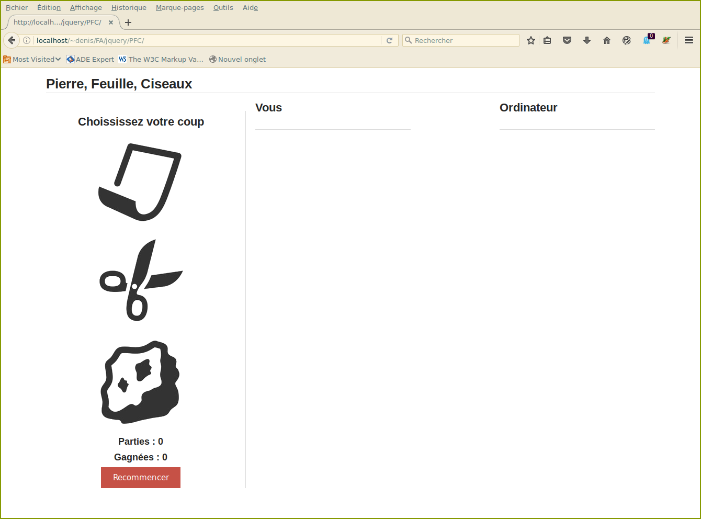
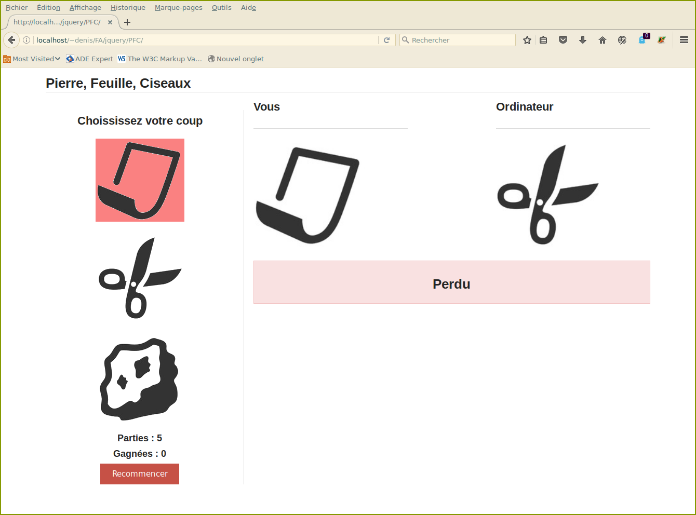

# TP javascript : Ajax, promesses. 

Vous disposez tous, à la racine de votre compte, d'un répertoire `public_html` qui est servi (http/https) par le serveur dwarves. 
Pour accéder à vos pages, utilisez l'url :

> http(s)://dwarves.[arda|iut-fbleau.fr]/~login 


#### Ex1
Écrire un client html qui permet d'envoyer en POST des messages (du texte) à un serveur echo. Vous écrirez le serveur en php. 

Le client affiche les échos du serveur, avec à chaque fois le temps d'échange.


Vous en écrirez deux versions :

- Echange des données au format `application/x-www-form-urlencoded` (données de formulaires).
- Echange des données au format `application/json`.

Le serveur renvoie uniquement du json.

#### Ex2
Le but est de créer un formulaire dont certains champs seront renseignés 
par des données retournées par un "service" web.

Pour commencer :

 - Le service est en fait la sélection d'un fichier contenant les informations à afficher.
 - On suppose que chaque code postal valide correspond à une seule commune.
	


Lorsque l'utilisateur saisit 5 chiffres, le nom de la ville et 
son département sont affichés dans les champs correspondants. (Dans le cas ou le 
code postal n'est pas connu, un message s'affiche dans une zone dédiée)

Les informations seront stockées dans des fichiers  
nommés `cp-xxxxx.txt` où xxxxx représente le code postal. Exemple pour le code 77300 :

 - format texte (cp-77300.txt)

   ```
	Fontainebleau,Seine et Marne	
   ```

 - format xml (cp-77300.xml)

   ```
	<?xml version="1.0" encoding="UTF-8"?>
		<codep>
			<ville>Fontainebleau</ville>
			<departement>Seine et Marne</departement>
		</codep>
   ```

 - format JSON (cp-77300.js)

   ```
		{
			"codep" : {
					"ville" : "Fontainebleau",
					"departement":"Seine et Marne"
			}
		}
   ```

**Il faut écrire une version par format !**

#### Ex3 
La situation précédente n'est pas très réaliste. Le but est de reprendre l'exercice précedent, à la seule différence que vous 
invoquerez un "vrai" service web.


> L'api libre [api-geo](https://api.gouv.fr/les-api/api-geo) permet de faire des recherches de communes suivant plusieurs critéres,
> dont le code postal. A l'aide de la documentation, modifiez votre code précédent en tulisant ce service.	

 **Attention** : Comme plusieurs villes peuvent correspondre au code postal, la champ Ville sera une liste de selection construite dynamiquement en fonction de la réponse à la reqûete ajax.


#### Ex4
Un chat avec Ajax.

On va écrire un chat rudimentaire en faisant sur un serveur du polling. Toutes les secondes, une requête Ajax 
interroge le serveur pour obtenir les nouveau messages, et actualiser leur liste sur le client.
	
Au départ, l'interface demande un pseudo.
	


La liste des messages en cours est alors affiché. A chaque fois que le client saisi un message,
celui-ci est mémorisé, et sera envoyé avec la prochaîne requête ajax.


Il faut évidemment coté serveur un [script](./ex3/php/chat.php) php qui mémorise tous les messages, et les envoie sur demande
au format json.

#### Ex5
Le but de l'exercice est d'écrire une version web du jeu de hasard **Pierre, Feuille, Ciseau**

Voici l'interface demandée :
	



Sur la gauche, se trouvent :
 - les [icones](/img/) d'une pierre, feuille et ciseaux, qui permettent
	à chaque tour de choisir son coup en cliquant dessus. Le passage avec la souris sur une icône change sa couleur de fond
 - Le nombre de coups joués et gagnées depuis le début d'une partie.
 - Un bouton **Recommencer** qui permet de recommencer une partie en  remettant à zéro les deux compteurs.

A droite :

Le coup joué par vous, ainsi que celui joué par l'ordinateur, avec un message indiquant Gagné, Egalité ou Perdu. On rappelle
que  **Pierre > Ciseaux, Feuille >  Pierre, Ciseaux > Feuille**.
A chaque tour, le coup joué par l'ordinateur sera récupéré à l'url 
	
>http://www.arda/jeu.php
 
 
